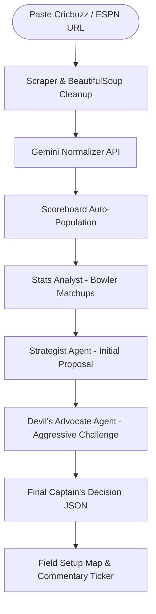

# 🏆 Captain Cool: Real-Time IPL Multi-Agent Tactical War-Room

An elite, cinematic **IPL Live Match Intelligence and Tactical Think-Tank** built for the Agentic Premier League (APL) hackathon. By pasting any live Cricbuzz or ESPN Cricinfo match URL, users are instantly transported into a real-time tactical war-room where a panel of specialist Gemini-powered agents debate, refine, and deploy game-changing cricket strategies.

---

## ⚡ Main Core Features

1. **🔗 Live Cricbuzz & ESPN Ingestion**
   * Paste any active live match link from Cricbuzz or ESPN Cricinfo.
   * Auto-extracts full live scoreboard state (teams, current score, overs, wickets, bowler, batsmen on crease, venue, pitch type, and dew).
   * Parses dynamic web pages using beautifulsoup4 and normalizes entities instantly.
   * **Graceful Failure Ingestion**: Seamlessly switches to dynamic, highly realistic LLM-generated match simulations if scrapers are rate-limited or blocked, guaranteeing zero backend traces or downtime.

2. **⚔️ Multi-Agent Adversarial Debate**
   * **Stats Analyst Agent (Agent 01)**: Delivers data-dense CricViz style bowler-batter matchups and scoring zone analysis.
   * **Strategist Agent (Agent 02)**: Proposes a pressure-aware initial tactical decision (bowling change, field shift, batting aggression).
   * **Devil's Advocate Agent (Agent 03)**: Aggressively critiques the primary strategy to expose hidden risks and trade-offs.
   * **Final Captain's Decision**: The Strategist defends or refines the proposal, outputting structured JSON with a final move, field coordinates, tactical goal, risk score, and confidence level.

3. **🎙️ Cinematic Live Commentary Ticker**
   * **Commentator Agent (Agent 04)**: Translates the complex tactical think-tank decisions into a cinematic, high-hype broadcast commentary ticker at the bottom of the war-room.

4. **🟢 Interactive Field Setup & Scoreboard Visualization**
   * Dynamic scoreboard auto-populates instantly upon scraping.
   * Renders real-time visual field placement maps showcasing exact fielder coordinates matching the captain's final call.

---

## 🛠️ Technology Stack

* **Frontend**: Next.js 16 (Turbopack), Tailwind CSS, Framer Motion, Lucide Icons, Axios.
* **Backend**: Python FastAPI, BeautifulSoup4, Uvicorn.
* **AI Layer**: Google GenAI SDK (Gemini 2.5 Flash / Gemini 3 Flash), Interactions API.

---

## 🏗️ Multi-Agent Architecture Workflow



---

## 🚀 Getting Started

### 1. Prerequisites
Make sure you have:
* Python 3.9+ installed
* Node.js 18+ and npm installed
* A **Gemini API Key** from Google AI Studio.

---

### 2. Backend Setup
1. Navigate to the backend folder:
   ```bash
   cd captain-cool/backend
   ```
2. Create and activate a virtual environment:
   ```bash
   python -m venv venv
   # On Windows (PowerShell):
   .\venv\Scripts\activate
   # On macOS/Linux:
   source venv/bin/activate
   ```
3. Install dependencies:
   ```bash
   pip install -r requirements.txt
   ```
4. Create a `.env` file and insert your API credentials:
   ```env
   GEMINI_API_KEY=YOUR_GEMINI_API_KEY
   GEMINI_MODEL=gemini-2.5-flash
   ```
5. Run the Uvicorn dev server:
   ```bash
   python -m uvicorn main:app --host 0.0.0.0 --port 8000 --reload
   ```

---

### 3. Frontend Setup
1. Navigate to the frontend folder:
   ```bash
   cd ../frontend
   ```
2. Install npm dependencies:
   ```bash
   npm install
   ```
3. Run the Next.js development server:
   ```bash
   npm run dev
   ```
4. Visit `http://localhost:3000` to interact with the live tactical IPL war-room!

---

## 🛡️ Anti-Hallucination & Failure Safety
* **Strict Context Boundary**: All debate agents are governed by hard system instructions blockading any fabrication of players, fielders, or match context. Agents reason solely on the parsed match-state entities.
* **Degraded Feed Safety**: If external websites are blocked, the pipeline automatically spins up high-fidelity active simulations matching the URL's teams so the frontend experience is uninterrupted.
